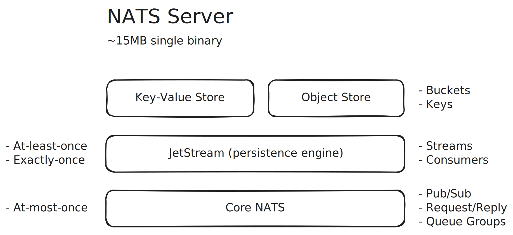

# NATS

- Messaging System / Connective Technology
- Designed for increasingly hyper-connected world
- Can replace many commonly used technologies with a single solution, including:
  - Traditional messaging: RabbitMQ, Azure Service Bus, Google Cloud Pub/Sub, etc.
  - Data streaming: Kafka, Azure Event Hubs, etc.
  - MQTT 3.1.1 brokers (with Sparkplug B compatibility): HiveMQ MQTT Broker, etc.
  - WebSocket servers: Centrifugo, Azure Web PubSub, Azure SignalR Service, etc.
  - Key-Value stores: Redis, etc.
  - Object stores: MinIO, S3, Azure Blob Storage, Google Cloud Storage, etc.
- Open source, Apache License 2.0
- Cloud Native Computing Foundation (CNCF) incubating project
- Known for its robustness
- Widely adopted
  - Used globally by thousands of companies
  - Use cases: microservices, stream processing, edge computing, web, mobile, IoT, etc.
  - 200M+ downloads
  - 1000+ contributors
  - SDKs available for all major programming languages (Go, Rust, C, .NET, Java, JavaScript, Python, etc.)
- Developed by Synadia
  - Synadia offers a NATS-as-a-Service solution
    - Synadia Cloud: A global, multi-cloud NATS platform with an admin portal and API, fully managed by Synadia.
    - Synadia Platform: NATS packaged with enterprise-grade features, available as a fully managed service by Synadia or for self-hosting.
- Simple
  - All features in a ~15MB single binary executable
  - No runtime dependencies
- Runs everywhere (on-prem, edge, cloud, containers, mobile, devices, etc.)
- Scales from a single NATS server to multi-cloud superclusters (cluster of clusters) and leaf nodes
- High performance
- Secure
- Multi-tenant

## Features

- Subject-based addressing
- Location-transparent
- Geo-aware
- Payload-agnostic
- Message headers
- Core NATS
  - Publish-Subscribe
  - Request-Reply
  - Queue Groups
- JetStream (the persistence layer on top of Core NATS)
  - Streams
  - Work Queues
  - Key-Value Store
  - Object Store
- Supported protocols
  - TCP (Standard NATS)
  - MQTT 3.1.1 with Sparkplug B compatibility
  - WebSocket
- Multi-Tenant (Accounts)
- Security
  - TLS
  - Token authentication
  - Username/Password (plain text or bcrypt-hashed passwords)
  - NKeys (highly secure public-key signature system based on Ed25519)
  - Decentralized JWT authentication/authorization
    - Zero-trust security
    - Roles: Operator, Account, User
  - Auth Callout (use any IAM solution, e.g., OAuth, LDAP, SAML, Microsoft Entra, Keycloak, ZITADEL, etc.)
- Server topologies
  - Single NATS server
  - Clustering
  - Superclusters (cluster of clusters) with gateway connections
  - Leaf Nodes (useful in IoT and edge scenarios)
- Monitoring
  - NATS Server provides a lightweight HTTP server on a dedicated monitoring port
  - Prometheus NATS Exporter

## NATS CLI

The best way to begin learning NATS is by using the NATS CLI.

## NATS Server



```bash
nats-server -c demo.conf
```

## Subject-Based Messaging

https://docs.nats.io/nats-concepts/subjects

## Core NATS

https://docs.nats.io/nats-concepts/core-nats

### Publish-Subscribe

```bash
nats sub demo.messages
```

```bash
nats pub demo.messages "hello world"
```

```bash
nats sub "demo.*.messages"
```

```bash
nats pub demo.en.messages "hello world"
```

```bash
nats pub demo.fi.messages "hei maailma"
```

```bash
nats sub "demo.>"
```

```bash
nats sub ">"
```

### Queue Groups

```bash
nats sub "demo.>" --queue demo
```

```bash
nats pub demo.messages "hello world"
```

### Request-Reply

```bash
nats reply demo.service "instance 1: pong"
```

```bash
nats reply demo.service "instance 2: pong"
```

```bash
nats request demo.service "ping"
```

```bash
nats reply "demo.weather.*" --command "curl -s wttr.in/{{2}}?0q"
```

```bash
nats request demo.weather.helsinki "" --raw
```

```bash
nats request demo.weather.london "" --raw
```

## JetStream

https://docs.nats.io/nats-concepts/jetstream

### Streams

```bash
nats stream add messages
```

| Configuration    | Value        |
| ---------------- | ------------ |
| Subjects         | `messages.>` |
| Retention Policy | `Limits`     |

```bash
nats stream add jobs
```

| Configuration    | Value        |
| ---------------- | ------------ |
| Subjects         | `jobs.>`     |
| Retention Policy | `Work Queue` |

```bash
nats stream ls
```

```bash
nats pub messages.demo "demo message {{.Count}}" --count 1000
```

```bash
nats pub jobs.demo "demo job {{.Count}}" --count 100
```

```bash
watch nats stream ls
```

### Consumers

```bash
nats consumer add messages messages
```

```bash
nats consumer add jobs jobs
```

```bash
nats consumer report
```

```bash
nats consumer next messages messages --count 10
```

```bash
nats consumer next jobs jobs --count 10
```

## Key-Value Store

https://docs.nats.io/nats-concepts/jetstream/key-value-store

```bash
nats kv add demo
```

```bash
nats kv put demo log_level "INFO"
```

```bash
nats kv put demo theme "dark"
```

```bash
nats kv ls
```

```bash
nats kv ls demo --verbose --display-value
```

```bash
nats kv watch demo
```

```bash
nats kv put demo log_level "WARN"
```

```bash
nats kv rm demo theme
```

## Object Store

https://docs.nats.io/nats-concepts/jetstream/obj_store

```bash
nats object add demo
```

```bash
echo "Lorem ipsum dolor sit amet" > lorem_ipsum.txt
```

```bash
nats object put demo lorem_ipsum.txt
```

```bash
nats object ls
```

```bash
nats object ls demo
```

```bash
nats object get demo lorem_ipsum.txt
```
