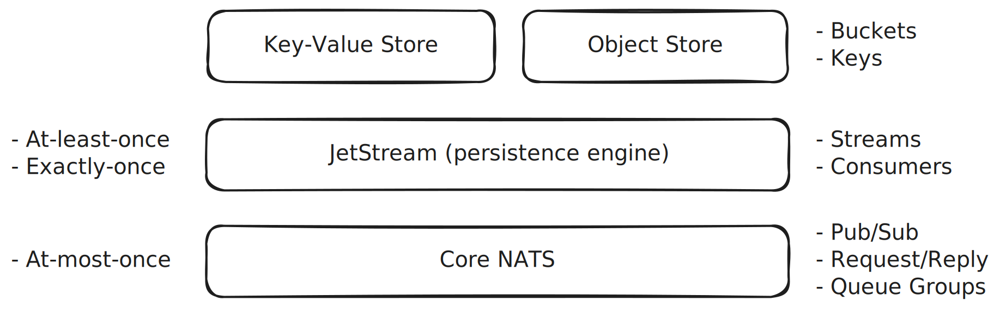

# NATS

## Overview

- Messaging System / Connective Technology

- Open source, Apache License 2.0

- Cloud Native Computing Foundation (CNCF) incubating project

- Developed by Synadia

  - Synadia also offers NATS-as-a-Service solutions, including Synadia Cloud and Synadia Platform.

- Can replace many commonly used technologies with a single solution:

  | Category              | Technologies                                                     |
  | --------------------- | ---------------------------------------------------------------- |
  | Traditional messaging | RabbitMQ, Azure Service Bus, Google Cloud Pub/Sub, AWS SNS & SQS |
  | Data streaming        | Kafka, Azure Event Hubs, RabbitMQ Streams                        |
  | WebSocket servers     | Centrifugo, Azure Web PubSub, Azure SignalR Service              |
  | MQTT 3.1.1 brokers    | HiveMQ MQTT Broker                                               |
  | Key-Value stores      | Redis, Valkey                                                    |
  | Object stores         | MinIO, S3, Azure Blob Storage, Google Cloud Storage              |

- Lightweight

  - All features in a ~15MB single binary
  - No runtime dependencies

- Runs everywhere (on-prem, edge, cloud, containers, mobile, devices, etc.)

- High performance

- Secure

- Multi-tenant

- Scales from a single NATS server to multi-cloud superclusters and leaf nodes

- Widely adopted

  - Known for its robustness, simplicity, and ease of use
  - Used globally by thousands of companies
  - Use cases: microservices, stream processing, edge computing, web, mobile, IoT, etc.
  - 1000+ GitHub contributors
  - 9000+ Slack members
  - 300M+ Docker pulls
  - Official SDKs available for all major programming languages (Go, Rust, C, .NET, Java, JavaScript, Python, etc.)

## Technology

- Subject-based addressing

- Location-transparent

- Geo-aware

- Payload-agnostic

- Message headers

- Core NATS

  - At-most-once delivery
  - No persistence
  - Publish-Subscribe
  - Request-Reply
  - Queue Groups

- JetStream

  - Persistence layer on top of Core NATS
    - File storage
    - Memory storage
  - At-least-once and exactly-once delivery
  - Streams
  - Consumers
    - Durable (persisted server-side, identified by name, shareable across clients for load balancing)
    - Ephemeral (not persisted, created at subscription time, deleted when the subscription is closed)
  - Advisories can be used to implement functionalities such as dead-letter queues (DLQ).

- Key-Value Store

  - Built on top of JetStream
  - Buckets
  - Keys
  - Allows configuring the number of historical values to retain per key.
  - Supports watching a bucket or key to receive real-time change notifications.
  - Provides atomic create and update operations for implementing features like distributed locking and concurrency control.

- Object Store

  - Built on top of JetStream
  - Buckets
  - Keys
  - Allows storing and retrieving files of any size by associating them with a path or file name as the key.
  - Supports watching a bucket to receive real-time change notifications.

- Supported protocols

  - TCP (Standard NATS)
  - MQTT 3.1.1 with Sparkplug B compatibility
  - WebSocket

- Multi-tenancy using Accounts

  - Accounts are secure, isolated messaging contexts that enable multi-tenancy in NATS.
  - Messaging between accounts is enabled by exporting and importing subject spaces.

- Security

  - TLS
  - Token authentication
  - Username/Password (plain text or bcrypt-hashed passwords)
  - NKeys (highly secure public-key signature system based on Ed25519)
  - Decentralized JWT authentication/authorization
    - Zero-trust security
    - Roles: Operator, Account, User
  - Auth Callout (use any IAM solution, e.g., OAuth, LDAP, Microsoft Entra ID, Keycloak, ZITADEL, etc.)

- Server topologies

  - Single NATS server
  - Clustering
  - Superclusters (cluster of clusters) with gateway connections
  - Leaf Nodes (useful in IoT and edge scenarios)

- Monitoring

  - NATS Server provides an HTTP monitoring endpoint.
  - Prometheus NATS Exporter
  - NATS Surveyor

## NATS CLI

https://docs.nats.io/using-nats/nats-tools/nats_cli

The best way to begin learning NATS is by using the NATS CLI.

## Demo



### NATS Server

```bash
nats-server -c demo.conf
```

### Subject-Based Messaging & Core NATS

https://docs.nats.io/nats-concepts/subjects

https://docs.nats.io/nats-concepts/core-nats

#### Publish-Subscribe

```bash
nats sub demo.messages
```

```bash
nats pub demo.messages "hello world"
```

```bash
nats sub "demo.*.messages"
```

```bash
nats pub demo.en.messages "hello world"
```

```bash
nats pub demo.fi.messages "hei maailma"
```

```bash
nats sub "demo.>"
```

```bash
nats sub ">"
```

#### Queue Groups

```bash
nats sub "demo.>" --queue demo
```

```bash
nats pub demo.messages "hello world"
```

#### Request-Reply

```bash
nats reply demo.service "instance 1: pong"
```

```bash
nats reply demo.service "instance 2: pong"
```

```bash
nats request demo.service "ping"
```

```bash
nats reply "demo.weather.*" --command "curl -s wttr.in/{{2}}?0q"
```

```bash
nats request demo.weather.helsinki "" --raw
```

```bash
nats request demo.weather.london "" --raw
```

### JetStream

https://docs.nats.io/nats-concepts/jetstream

#### Streams

```bash
nats stream add messages
```

| Configuration    | Value        |
| ---------------- | ------------ |
| Subjects         | `messages.>` |
| Retention Policy | `Limits`     |

```bash
nats stream add jobs
```

| Configuration    | Value        |
| ---------------- | ------------ |
| Subjects         | `jobs.>`     |
| Retention Policy | `Work Queue` |

```bash
nats stream ls
```

```bash
nats pub messages.demo "demo message {{.Count}}" --count 1000
```

```bash
nats pub jobs.demo "demo job {{.Count}}" --count 100
```

```bash
watch nats stream ls
```

#### Consumers

```bash
nats consumer add messages messages
```

```bash
nats consumer add jobs jobs
```

```bash
nats consumer report
```

```bash
nats consumer next messages messages --count 10
```

```bash
nats consumer next jobs jobs --count 10
```

### Key-Value Store

https://docs.nats.io/nats-concepts/jetstream/key-value-store

```bash
nats kv add demo
```

```bash
nats kv put demo log_level "INFO"
```

```bash
nats kv put demo theme "dark"
```

```bash
nats kv ls
```

```bash
nats kv ls demo --verbose --display-value
```

```bash
nats kv watch demo
```

```bash
nats kv put demo log_level "WARN"
```

```bash
nats kv rm demo theme
```

### Object Store

https://docs.nats.io/nats-concepts/jetstream/obj_store

```bash
nats object add demo
```

```bash
echo "Lorem ipsum dolor sit amet" > lorem_ipsum.txt
```

```bash
nats object put demo lorem_ipsum.txt
```

```bash
nats object ls
```

```bash
nats object ls demo
```

```bash
nats object get demo lorem_ipsum.txt
```
